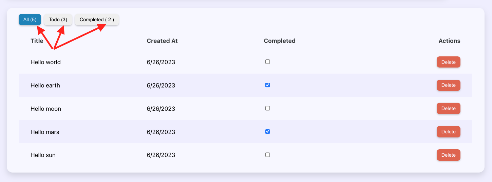

# ⚛️ React Master - Todo list: Gérer les états complexes avec `useReducer` (Correction)

## Sommaire

<!-- no toc -->
*   [Notions](#notions-de-lexercice)
*   [Consignes](#consignes)
*   [Correction](#correction)

## Notions de l'exercice

*   Context
*   Reducer

## Consignes

Pour cet exercice, tu vas devoir cloner le dépôt.

Tu peux taper la commande suivante dans ton terminal:

```bash
git clone git@github.com:Atomic-React/react-master-todo-list.git
```

Ensuite, rends toi dans le dossier avec la commande suivante:

```bash
cd react-master-todo-list
```

Accède à la branche de l'exercice en exécutant la commande:

```bash
git switch ex12/exercise
```

Puis installes les dépendances avec la commande:

```bash
npm install
```

Tu peux maintenant te rendre sur l'URL <http://localhost:5173>.

Cet exercice va se dérouler en deux temps.

D'abord, tu va devoir modifier le composant du contexte des tâches pour qu'il utilise `useReducer` à la place de `useState`.

`useReducer` joue le même rôle que `useState`, il permet d'interagir avec l'état d'un composant. Cependant, `useReducer` permet de gérer des états plus complexes de part les fonctionnalités qu'il propose.

Je te laisse découvrir cela en te rendant sur la documentation de **React**: <https://react.dev/reference/react/useReducer>

Ensuite, il faudra que tu rajoutes des compteurs de tâches comme affichés ci-dessous sur les boutons des onglets:



Tu as donc trois compteurs différents à ajouter. Tous doivent être gérés via le `useReducer` et doivent se mettre à jour automatiquement suite à l'ajout, la suppression ou la modification d'une tâche.

Bon courage ! 💪

## Correction

Tu peux consulter la correction écrite ici: <https://github.com/Atomic-React/react-master-todo-list/tree/ex12/correction#correction>

Ou suivre la correction en vidéo ici: _Bientôt disponible_
