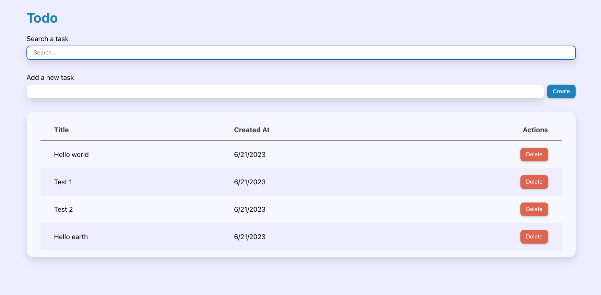

# ⚛️ React Master - Todo list: Composant contrôlé avec un champ de recherche (Exercice)

## Sommaire

<!-- no toc -->
*   [Notions](#notions-de-lexercice)
*   [Consignes](#consignes)
*   [Correction](#correction)

## Notions de l'exercice

*   Événements
*   Props
*   Gestion d'état
*   Typage des props
*   Composants contrôlés
*   Passage de référence

## Consignes

Sauvegarde d'abord le travail de l'exercice précédent:

```bash
git add .
```

```bash
git commit -m "exercice terminé"
```

Ensuite, accède à la branche de l'exercice en exécutant la commande:

```bash
git switch ex03/exercise
```

Puis installes les dépendances avec la commande:

```bash
npm install
```

Et lance l'application:

```bash
npm run dev
```

Tu peux maintenant te rendre sur l'URL <http://localhost:5173>.

Voici une capture d'écran du rendu final que tu dois obtenir:



Dans cet exercice, tu dois réaliser une champ de recherche des tâches en utilisant cette fois-ci un **composant contrôlé**.

<details>
 <summary>💡 <b>Indice</b></summary>

 >
 > Voici le lien de la documentation **React** qui parle des champs contrôlés: <https://react.dev/reference/react-dom/components/input#controlling-an-input-with-a-state-variable>

</details>

Lorsque l'utilisateur tape dans la barre de recherche, le tableau des tâches doit afficher les résultats correspondants.

Si la barre de recherche est vide, le tableau doit afficher la totalité des tâches.

Pour réaliser cette barre de recherche, tu devra créer un nouveau composant dédié.

Il est fort conseillé de réutiliser le composant `InputText` déjà fait pour concevoir ce champ de recherche. De cette façon, nul besoin de réinventer la roue ou de dupliquer du code.

Bon courage ! 💪

## Correction

Créons le composant `InputSearch` dans le dossier `components/forms/`. Ce composant va faire appel à `InputText` pour nous éviter d'avoir à réécrire la plupart du code nécessaire:

```JSX
import InputText from '../InputText';
import { object, string } from 'prop-types';

const InputSearch = ({ label, style, ...htmlInputProps }) => {

	return (
		<InputText label={ label } style={ style } type="search" { ...htmlInputProps } />
	);
};

export default InputSearch;

InputSearch.propTypes = {
	label: string,
	style: object,
};

InputSearch.defaultProps = {
	label: '',
	style: {},
};
```

Ce champ devra émettre un événement `onSearch` au moment où l'utilisateur tape des caractères dans la barre de recherche. Cet événement pourra être géré dans le composant parent pour réagir à la recherche et exécuter le code nécessaire en conséquence.

On s'attend donc à ce que le composant `InputSearch` reçoive une props `onSearch`:

```JSX
import InputText from '../InputText';
import { object, string, func } from 'prop-types';

// On récupère `onSearch` depuis les props et on le renomme `handleSearch`
const InputSearch = ({ label, style, onSearch: handleSearch, ...htmlInputProps }) => {

	const handleChangeInputValue = (event) => {
		// On récupère la valeur depuis l'événement et on l'envoie dans le handleSearch (onSearch)
		handleSearch(event.target.value);
	};

	return (
		<InputText label={ label } style={ style } type="search" onChange={ handleChangeInputValue } { ...htmlInputProps } />
	);
};

export default InputSearch;

// On pense au typage de props !
InputSearch.propTypes = {
	label: string,
	style: object,
	onSearch: func,
};

InputSearch.defaultProps = {
	label: '',
	style: {},
	onSearch: () => {},
};
```

L'événement `onChange` sur un champ est déclenché lorsque l'utilisateur modifie la valeur du champ. Cette événement sera émit à chaque fois que l'utilisateur tape un caractère.

Dans `App.jsx`, il faut maintenant nous occuper de la recherche. Pour cela on intègre le champ de recherche dans une `div` juste après le titre `h1`:

```jsx
const App = () => {

	// ...

	return (
		<div className="container">
			<h1 className="text--primary">Todo</h1>
			<div style={{ display: 'flex', gap: 8, marginBottom: 32 }}>
				<InputSearch label="Search a task" placeholder="Search..." style={{ flexGrow: 1 }} />
			</div>
			<div style={{ display: 'flex', gap: 8, marginBottom: 32 }}>
				<InputText label="Add a new task" style={{ flexGrow: 1 }} ref={ newTaskInputRef } />
				<Button onClick={ handleCreateNewTask } style={{ marginTop: 'auto' }}>Create</Button>
			</div>
			<Block>
				<Tasks tasks={ tasks } onDeleteTask={ handleDeleteTask } onUpdateTask={ handleUpdateTask } />
			</Block>
		</div>
	);
};
```

Maintenant parlons "champ contrôlé".

Ce champ doit être contrôlé par le `state` d'un composant parent car nous avons besoin de réagir au changement de valeur, d'être en écoute systématique sur ce champ.

Nous allons donc récupérer la valeur dans le `state` du composant `App` pour pouvoir l'exploiter:

```jsx
const App = () => {

	const newTaskInputRef = useRef(null);

	const [ tasks, setTasks ] = useState([]);
	// On déclare la propriété du state qui accueille la valeur du champ de recherche
	const [ searchTaskValue, setSearchTaskValue ] = useState('');
	
	// ...

	const handleSearchTask = (value) => {
		// Dès que l'utilisateur tape un caractère, on transmet la valeur du champ à jour dans le state
		setSearchTaskValue(value);
	}

	return (
		<div className="container">
			<h1 className="text--primary">Todo</h1>
			<div style={{ display: 'flex', gap: 8, marginBottom: 32 }}>
				{ /* le onSearch déclenche handleSearchTask qui opère à la mise à jour du state. La value du champ doit être égale à la valeur du state */ }
				<InputSearch label="Search a task" placeholder="Search..." value={ searchTaskValue } onSearch={ handleSearchTask } style={{ flexGrow: 1 }} />
			</div>
			<div style={{ display: 'flex', gap: 8, marginBottom: 32 }}>
				<InputText label="Add a new task" style={{ flexGrow: 1 }} ref={ newTaskInputRef } />
				<Button onClick={ handleCreateNewTask } style={{ marginTop: 'auto' }}>Create</Button>
			</div>
			<Block>
				<Tasks tasks={ tasks } onDeleteTask={ handleDeleteTask } onUpdateTask={ handleUpdateTask } />
			</Block>
		</div>
	);
};

export default App;
```

Le fait de placer `searchTaskValue` qui vient du `state` en valeur de l'attribut `value` de `InputSearch` permet de forcer la synchronisation entre le champ et le state du composant parent, de forcer le champ à utiliser le `state` en tant que valeur de référence et ne plus utiliser son état interne. C'est la définition d'un composant contrôlé.

Il ne nous manque plus que la fonction de recherche. Je rajoute cette fonction au dessus du composant `App`:

```jsx
// Elle prend le tableau des tâches et la valeur du champ de recherche en arguments
const getSearchedTasks = (tasks = [], searchValue = '') => {
	// On filtre en fonction des tâches recherchées sur le titre
	return tasks.filter(task => task.title.toLowerCase().includes(searchValue.toLowerCase()));
};
```

Puis on met à jour `Tasks` dans le JSX pour faire en sorte que s'il y a une recherche en cours, il utilise la fonction de recherche, sinon, il utilise le tableau des tâches:

```jsx
<Block>
	<Tasks tasks={ searchTaskValue ? getSearchedTasks(tasks, searchTaskValue) : tasks } onDeleteTask={ handleDeleteTask } onUpdateTask={ handleUpdateTask } />
</Block>
```

Voici le composant `App` dans son état final:

```jsx
import { useRef } from 'react';
import Block from '../../todo-list/src/components/ui/Block';
import Tasks from './components/features/Tasks';
import Button from '../../todo-list/src/components/ui/Button';
import { useState } from 'react';
import { useEffect } from 'react';
import InputText from './components/forms/InputText';
import InputSearch from './components/forms/InputSearch';

const getSearchedTasks = (tasks = [], searchValue = '') => {
	return tasks.filter(task => task.title.toLowerCase().includes(searchValue.toLowerCase()));
};

const App = () => {

	const newTaskInputRef = useRef(null);

	const [ tasks, setTasks ] = useState([]);
	const [ searchTaskValue, setSearchTaskValue ] = useState('');

	useEffect(() => {
		newTaskInputRef.current.value = '';
	}, [ tasks ]);

	const handleCreateNewTask = () => {
		const title = newTaskInputRef.current.value;
		const idsList = tasks.map(({ id }) => id);
		const maxId = idsList.length > 0 ? Math.max(...idsList) : 0;
		const newId = maxId + 1;
		setTasks([
			...tasks,
			{
				id: newId,
				title,
				created_at: new Date(),
			},
		]);
	};

	const handleDeleteTask = (taskId) => () => {
		setTasks(tasks.filter(({ id }) => id !== taskId));
	};

	const handleUpdateTask = (taskId) => (updatedTask) => {
		const updatedTasks = tasks.map(task => {
			if (task.id === taskId) {
				return {
					...task,
					...updatedTask,
				};
			}
			return task;
		})
		setTasks(updatedTasks);
	}

	const handleSearchTask = (value) => {
		setSearchTaskValue(value);
	}

	return (
		<div className="container">
			<h1 className="text--primary">Todo</h1>
			<div style={{ display: 'flex', gap: 8, marginBottom: 32 }}>
				<InputSearch label="Search a task" placeholder="Search..." value={ searchTaskValue } onSearch={ handleSearchTask } style={{ flexGrow: 1 }} />
			</div>
			<div style={{ display: 'flex', gap: 8, marginBottom: 32 }}>
				<InputText label="Add a new task" style={{ flexGrow: 1 }} ref={ newTaskInputRef } />
				<Button onClick={ handleCreateNewTask } style={{ marginTop: 'auto' }}>Create</Button>
			</div>
			<Block>
				<Tasks tasks={ searchTaskValue ? getSearchedTasks(tasks, searchTaskValue) : tasks } onDeleteTask={ handleDeleteTask } onUpdateTask={ handleUpdateTask } />
			</Block>
		</div>
	);
};

export default App;
```

L'exercice est terminé ! 👏
