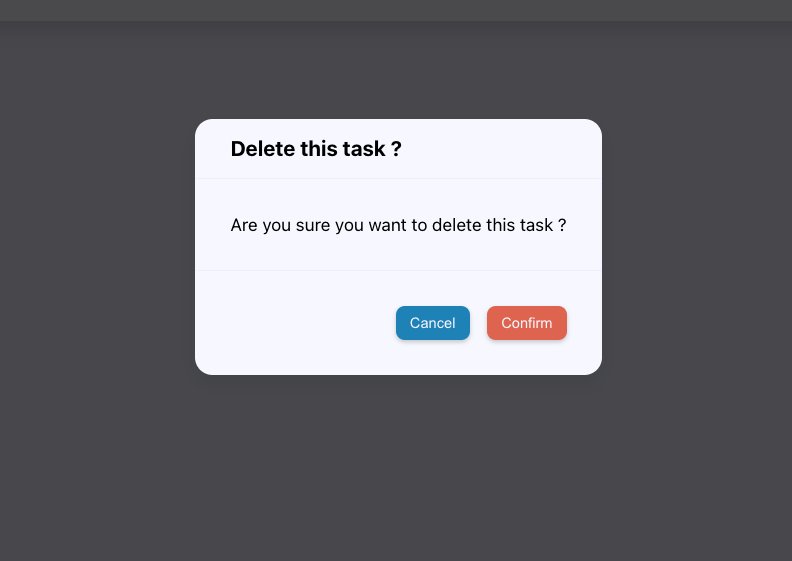

# ⚛️ React Master - Todo list: Validation de formulaire (Exercice)

## Sommaire

<!-- no toc -->
*   [Notions](#notions-de-lexercice)
*   [Consignes](#consignes)
*   [Correction](#correction)

## Notions de l'exercice

*   Événements
*   Props
*   Gestion d'état
*   Typage des props
*   Portails

## Consignes

Sauvegarde d'abord le travail de l'exercice précédent:

```bash
git add .
```

```bash
git commit -m "exercice terminé"
```

Ensuite, accède à la branche de l'exercice en exécutant la commande:

```bash
git switch ex05/exercise
```

Puis installes les dépendances avec la commande:

```bash
npm install
```

Et lance l'application:

```bash
npm run dev
```

Tu peux maintenant te rendre sur l'URL <http://localhost:5173>. Tu y trouvera l'application dans le même état qu'à la fin de la correction de l'exercice précédent.

Dasn cet exercice, tu vas devoir obtenir le rendu suivant:



Il s'agit d'une modale permettant de demander la confirmation à l'utilisateur lorsque celui-ci clique sur le bouton de suppression d'une tâche.

Évidemment, le bouton _"Cancel"_ doit permettre l'annulation de la suppression, c'est à dire de fermer la modale sans supprimer la tâche. Et le bouton _"Confirm"_ est comme son nom l'indique le bouton de confirmation; il doit supprimer la tâche et également fermer la modale.

Pour réaliser cette modale, je te recommande de d'abord créer un composant `Modal` générique que tu va pouvoir réutiliser.

<details>
 <summary>💡 <b>Indice</b></summary>

 > Lorsque tu vas vouloir utiliser ta modale au niveau des lignes du tableau correspondantes au tâches, tu risques d'avoir des erreurs dans la console. Notamment une qui te dit qu'une `div` ne peut pas être enfants d'éléments de tableaux. Pour corriger cela tu peux utiliser les _portails_.
 >
 > C'est une fonctionnalité de **React** qui te permet de "téléporter" des éléments dans le DOM pour les placer où tu veux dans ton JSX tout en respectant la sémantique.
 >
 > Voici le lien de la documentation **React** qui parle des _portails_: <https://react.dev/reference/react-dom/createPortal>

</details>

Une fois ton composant `Modal` réalisé, crée un nouveau composant qui utilisera `Modal` et qui sera en charge de la confirmation de suppression des tâches.

Bon courage ! 💪

## Correction

Tu peux consulter la correction écrite ici: <https://github.com/Atomic-React/react-master-todo-list/tree/ex06/correction#correction>

Ou suivre la correction en vidéo ici: _Bientôt disponible_
