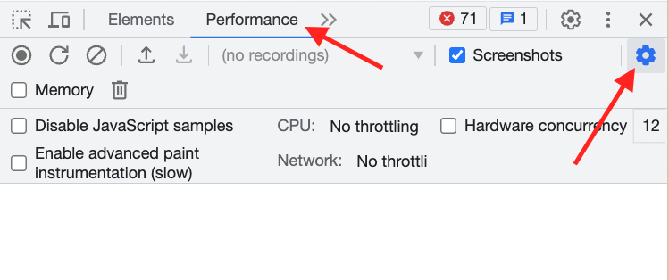
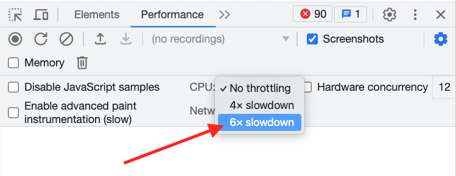

# ⚛️ React Master - Todo list: Optimiser le champ de recherche (Correction)

Dans cet énoncé tu trouvra:

1 💡 indice

## Sommaire

<!-- no toc -->
*   [Notions](#notions-de-lexercice)
*   [Consignes](#consignes)
*   [Correction](#correction)

## Notions de l'exercice

*   Événements
*   Props
*   Gestion d'état
*   Typage des props
*   Composants contrôlés
*   Passage de référence

## Consignes

Pour cet exercice, tu vas devoir cloner le dépôt.

Tu peux taper la commande suivante dans ton terminal:

```bash
git clone git@github.com:Atomic-React/react-master-todo-list.git
```

Ensuite, rends toi dans le dossier avec la commande suivante:

```bash
cd react-master-todo-list
```

Accède à la branche de l'exercice en exécutant la commande:

```bash
git switch ex04/exercise
```

Puis installes les dépendances avec la commande:

```bash
npm install
```

Tu peux maintenant te rendre sur l'URL <http://localhost:5173>. Tu verra qu'il y a beaucoup de tâches qui ont été générées.

Pour cet exercice, nous aurons besoin de faire une petite simulation.

Admettons que tu disposes d'un ordinateur ayant des performances assez faibles, tu te rendra compte que la recherche des tâches va être vite compliquée et qu'elle va avoir pas mal de latence.

Pour réaliser cette simulation tu vas avoir besoin de brider volontairement ton navigateur en allant dans l'onglet _"performances"_ de ta console. Cliques ensuite sur la roue dentée en haut à droite:



Puis clique sur _"CPU: No throttling"_ et sélectionne _"6x slowdown"_:



Ton navigateur va alors se brider et être 6 fois plus lent.

Désormais, si tu tentes d'effectuer une recherche, tu verra que la recherche lag beaucoup plus.

Il se peut que la recherche lag même sans que tu aies bridé ton navigateur. Et c'est tout à fait normal si tu cliques sur le champ de recherche et que tu ne peux pas écrire dedans immédiatement, c'est le temps que **React** rende toutes les tâches dans le tableau.

À toi d'optimiser l'interface pour permettre aux personnes ayant un ordinateur peu puissant de l'utiliser avec un minimum de confort.

Il y a des chances que la recherche lag encore même après l'optimisation. Malheureusement, il y a des limites matérielles qui parfois nous empêchent d'optimiser davantage les applications. Ce n'est pas grave. Contente toi de faire de ton mieux.

En principe, après optimisation, tu devrais tout de même voir une nette amélioration.

<details>
 <summary>💡 <b>Indice</b></summary>

 > Il y a deux moyens mis à disposition par **React** pour ce genre d'optimisation. Tu peux utiliser le hook `useDeferredValue` ou le hook `useTransition`.
 >
 > Il y a évidemment des différences entre les deux. Je te laisse les découvrir. Nous verrons les verront pendant la correction.
 >
 > Voici le lien de la documentation **React** qui parle de `useDeferredValue`: <https://react.dev/reference/react/useDeferredValue>
 >
 > Voici le lien de la documentation **React** qui parle de `useTransition`: <https://react.dev/reference/react/useTransition>

</details>

Bon courage ! 💪

## Correction

### `useTransition`

**React** met à notre disposition deux solutions différentes pour deux cas différents de situation.

Le premier cas, c'est le nôtre, c'est celui où on a le contrôle sur le `state` qui est à l'origine de la mise à jour dans l'interface. Le `state` en question, c'est celui du champ de recherche. C'est `searchTaskValue` qui est responsable du déclenchement de la recherche.

Nous avons créé ce champ de recherche et nous contrôlons la mise à jour du `state` de la valeur de ce champ.

Dans ce cas, nous pouvons utiliser le hook `useTransition` qui comme sont nom l'indique va nous permettre de réaliser une sorte de transition entre le moment où l'on tape des caractères dans le champ et le moment où le processus de recherche s'achève.

`useTransition` retourne un tableau qui met à notre disposition deux éléments:

1.   Le premier est un boolean permettant de savoir si une transition est en cours.
2.   Le second est une fonction permettant de déclencher une transition

```js
const [ isPending, startTransition ] = useTransition();
```

Comme avec `useState`, on peut nommer ces valeurs comme bon nous semble en fonction du contexte d'utilisation. Par exemple:

```js
const [ isSearchTasksPending, startSearchTasksTransition ] = useTransition();
```

On vient ensuite modifier la fonction de recherche pour placer la mise à jour du `state` de la valeur de recherche la fonction qui déclenche la transition.

```js
const handleSearchTask = (value) => {
	startSearchTasksTransition(() => {
		setSearchTaskValue(value);
	});
};
```

Si on teste, il y a toujours du lag. Ce lag est causé par le fait que la mise à jour du `state` du champ de recherche est ralentie par la transition. Du coup, on a l'impression que le champ lag.

Ce qu'il faut faire, c'est supprimer la `value` reliée au `state` sur `InputSearch` dans `App`:

```jsx
<InputSearch label="Search a task" placeholder="Search..." onSearch={ handleSearchTask } style={{ flexGrow: 1 }} />
```

Tant pis pour le fait de forcer la synchronisation entre le `state` et le champ... Nous verrons dans la prochaine leçon comment nous pouvons résoudre cela.

En attendant... Ça semble mieux fonctionner ainsi !

La latence restante peut être plus difficile à traiter et dépend des performances de la machine dont dispose l'utilisateur. On peut faire des optimisations pour améliorer l'expérience utilisateur mais il est évident qu'on ne peut pas faire de miracles. Il y a des limites physiques qu'on ne peut pas franchir.

Dans notre cas, l'expérience est déjà bien améliorée.

On peut faire encore mieux en affichant un message indiquant que la recherche est en cours.

Pour cela il faut modifier le composant `Tasks` pour rajouter une props `isLoading`:

```jsx
import './Tasks.css';

import { arrayOf, shape, string, number, instanceOf, func, bool } from 'prop-types';
import Task from './Task';

const Tasks = ({ tasks, onDeleteTask: handleDeleteTask, onUpdateTask: handleUpdateTask, isLoading }) => {

	return (
		<>
			<table className="tasks-table">
				<thead>
					<tr>
						<th>Title</th>
						<th>Created At</th>
						<th>Actions</th>
					</tr>
				</thead>
				<tbody>
					{
						!isLoading &&
						tasks.map((task) => <Task key={task.id} onDeleteTask={ handleDeleteTask(task.id) } onUpdateTask={ handleUpdateTask(task.id) } {...task} />)
					}
				</tbody>
			</table>
			{ !tasks || tasks.length === 0 && <p style={{ textAlign: 'center' }}>No data</p>}
			{ isLoading && <p style={{ textAlign: 'center' }}>Loading data...</p>}
		</>
	);
};

export default Tasks;

Tasks.propTypes = {
	tasks: arrayOf(shape({
		id: number.isRequired,
		title: string.isRequired,
		created_at: instanceOf(Date).isRequired,
	})),
	onDeleteTask: func.isRequired,
	onUpdateTask: func.isRequired,
	isLoading: bool,
};

Tasks.defaultProps = {
	tasks: [],
	isLoading: false,
};
```

Ensuite, retournons dans `App.jsx` pour utiliser cette nouvelle props:

```jsx
<Tasks isLoading={ isSearchTasksPending } tasks={ searchTaskValue ? getSearchedTasks(tasks, searchTaskValue) : tasks } onDeleteTask={ handleDeleteTask } onUpdateTask={ handleUpdateTask } />
```

> ℹ️ **Information**
>
> `startTransition` peut être utilisé sans `useTransition`. Dans ce cas, nous ne disposons pas du boolean permettant de savoir si la transition est en cours ou non.

L'utilisation de ce système de transition permet de donner la priorité à la mise à jour du `state` du champ de recherche au niveau de l'interface utilisateur.

Nous pouvons l'utiliser ici car nous avons directement accès au `state` du champ de recherche.

Mais si ce n'était pas le cas ? Si nous ne pouvions pas avoir accès au `state` du champ de recherche, comment ferions-nous ?

### `useDeferredValue`

Dans les cas où le `state` à l'origine d'un changement dans l'interface n'est pas accessible, **React** met à notre disposition un autre hook qui s'appelle `useDeferredValue`.

Ce hook s'utilise directement sur les données à afficher. Dans notre cas, il s'utilise dans le composant `Tasks`:

```jsx
const Tasks = ({ tasks, onDeleteTask: handleDeleteTask, onUpdateTask: handleUpdateTask, isLoading }) => {

	const deferredTasks = useDeferredValue(tasks);

	return (
		<>
			<table className="tasks-table">
				<thead>
					<tr>
						<th>Title</th>
						<th>Created At</th>
						<th>Actions</th>
					</tr>
				</thead>
				<tbody>
					{
						!isLoading &&
						// Il faut ensuite utiliser deferredTasks ici !
						deferredTasks.map((task) => <Task key={task.id} onDeleteTask={ handleDeleteTask(task.id) } onUpdateTask={ handleUpdateTask(task.id) } {...task} />)
					}
				</tbody>
			</table>
			{ !tasks || tasks.length === 0 && <p style={{ textAlign: 'center' }}>No data</p>}
			{ isLoading && <p style={{ textAlign: 'center' }}>Loading data...</p>}
		</>
	);
};
```

On peut retourner dans `App.jsx` pour commenter l'utilisation de la transition:

```jsx
const handleSearchTask = (value) => {
	// startSearchTasksTransition(() => {
	// 	setSearchTaskValue(value);
	// });
	setSearchTaskValue(value);
};
```

On peut même refaire la liaison entre le `state` et la `value` de l'`InputSearch`:

```jsx
<InputSearch label="Search a task" placeholder="Search..." value={ searchTaskValue } onSearch={ handleSearchTask } style={{ flexGrow: 1 }} />
```

Puisse que ce n'est plus le `state` qui est en attente ici mais l'affichage des tâches.

Les deux hooks ne doivent pas être utilisés en même temps car ils peuvent impliquer une baisse de performances, ce qui est le contraire de l'effet recherché.

Garde à l'esprit qu'avec **React**, toute optimisation de performances nécessite une réflexion préalable pour en déterminer la pertinence et les effets.

Si on teste à nouveau, on observe de nouveau un gain de performances au niveau du champ de recherche, notamment lorsqu'on efface des caractères.

Avec `useDeferredValue`, on ne dit pas à **React** de rendre la mise à jour du champ prioritaire. On lui indique que l'affichage des résultats doit être différé. En gros il attend que les mises à jour du `state` soient terminées pour pouvoir faire un re-rendu.
