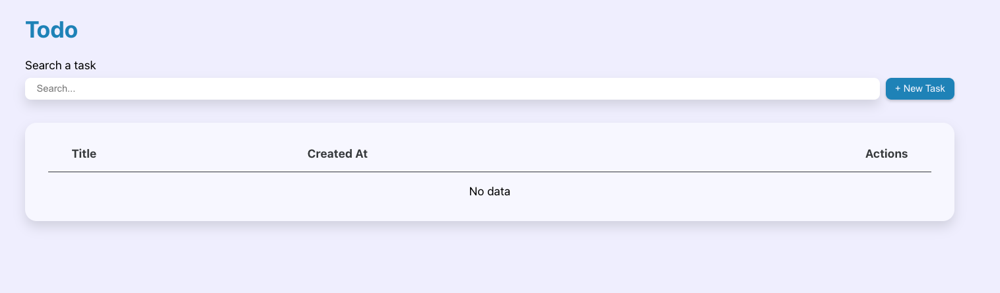
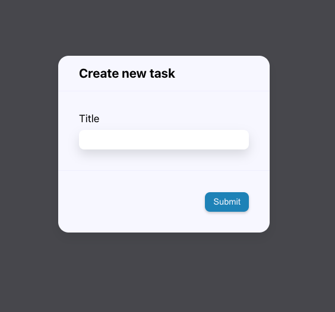

# ⚛️ React Master - Todo list: Composant polymorphique (Exercice)

## Sommaire

<!-- no toc -->
*   [Notions](#notions-de-lexercice)
*   [Consignes](#consignes)
*   [Correction](#correction)

## Notions de l'exercice

*   Props
*   Composant polymorphique

## Consignes

Sauvegarde d'abord le travail de l'exercice précédent:

```bash
git add .
```

```bash
git commit -m "exercice terminé"
```

Ensuite, accède à la branche de l'exercice en exécutant la commande:

```bash
git switch ex08/exercise
```

Puis installes les dépendances avec la commande:

```bash
npm install
```

Et lance l'application:

```bash
npm run dev
```

Tu peux maintenant te rendre sur l'URL <http://localhost:5173>.

Si tu n'as pas fait l'exercice bonus, note que nous avons rajouté un _custom hook_ dénommé `useClickOutSide` permettant de détecter lorsque l'on clique à l'extérieur d'un élément précis. Nous l'utilisons notamment dans le cadre de la modale pour fermer la modale lorsque l'utilisateur clique à l'extérieur.

Dans cet exercice, tu vas devoir placer le formulaire de création d'une tâche dans une modale.

Sur la capture d'écran ci-dessous, tu peux voir qu'il n'y a un bouton _"+ New task"_ à côté du champ de recherche:



Ce bouton doit ouvrir cette modale:



Tu peux utiliser le composant `CreateTaskForm` pour le convertir en modale à l'aide du composant `Modal` et ses _"composants secondaires"_.

Cependant, le composant `Modal` est une `div`. Nous aimerions que ce composant soit aussi capable de prendre en charge d'autres éléments HTML comme la balise `form`.

Nous devrions pouvoir indiquer à la `Modal` de se convertir en formulaire pour nos besoins de cette façon: `<Modal as="form">`

La propriété `as` doit pouvoir prendre en valeur n'importe quel nom de balise HTML pour permettre à la `Modal` d'adopter le comportement de la balise souhaitée.

Ceci est un pattern que l'on appelle le _"polymorphisme"_. Je t'invite donc à te renseigner du côté des _"composants polymorphiques"_ (_"polymorphic components"_ en anglais).

Bon courage ! 💪

## Correction

Tu peux consulter la correction vidéo sur [Atomic React](https://atomic-react.com) ou te rendre sur la branche `ex08/correction`.

Pense à sauvegarder ton travail avec les commandes ci-dessous avant de changer de branche !

```bash
git add .
```

```bash
git commit -m "Sauvegarde"
```
