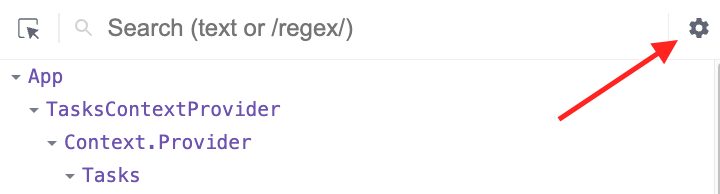
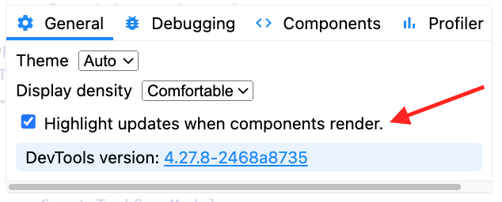
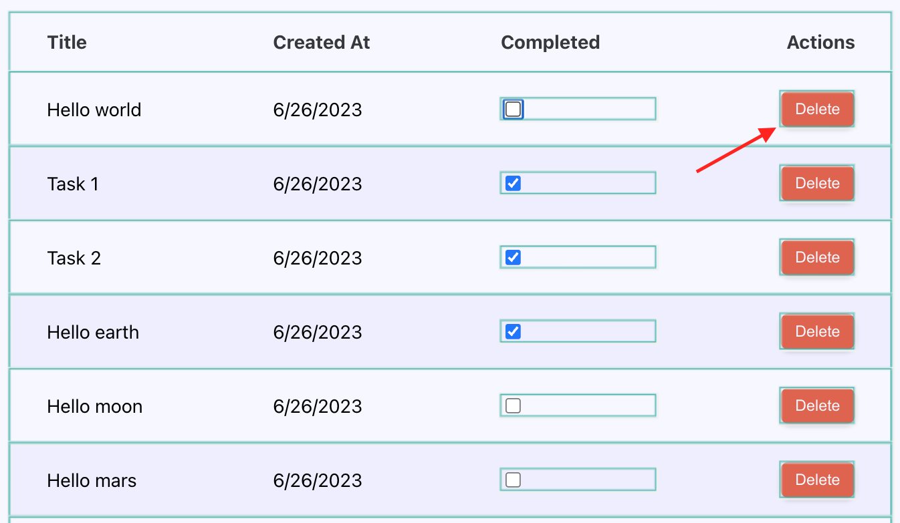

# ⚛️ React Master - Todo list: Mémoiser un composant (Correction)

## Sommaire

<!-- no toc -->
*   [Notions](#notions-de-lexercice)
*   [Consignes](#consignes)
*   [Correction](#correction)

## Notions de l'exercice

*   `memo`
*   `useCallback`

## Consignes

Pour cet exercice, tu vas devoir cloner le dépôt.

Tu peux taper la commande suivante dans ton terminal:

```bash
git clone git@github.com:Atomic-React/react-master-todo-list.git
```

Ensuite, rends toi dans le dossier avec la commande suivante:

```bash
cd react-master-todo-list
```

Accède à la branche de l'exercice en exécutant la commande:

```bash
git switch ex15/exercise
```

Puis installes les dépendances avec la commande:

```bash
npm install
```

Tu peux maintenant te rendre sur l'URL <http://localhost:5173>.

Il y a dans notre application des composants qui se re-rendent très souvent, à chaque mise à jour d'état, alors qu'ils n'en ont pas forcément besoin.

Par exemple, le bouton `Delete` de chaque tâche, une fois rendu n'a pas besoin de se re-rendre quand on coche la case _"Completed"_ ou quand on modifie le nom de la tâche.

Le bouton `Delete` ne change pas d'état: Il s'appelle toujours `Delete` et la fonction de confirmation liée à la modale contient toujours la même valeur.

Je t'invite à ouvrir ta console et à te rendre sur l'onglet **⚛️ Components**.

Clique sur la roue dentée en haut à droite pour ouvrir les paramètres:



Puis coche la case _"Highlight updates when components render."_ dans l'onglet _"General"_:



Ce paramètre va te permettre de mettre évidence les re-rendus de tes composants. (Tu pourra le désactiver plus tard)

À chaque fois qu'un composant se re-rendra, une bordure apparaîtra brièvement autour de ce composant.

Par exemple, le composant `DeleteTaskConfirmationModal` se re-rend à chaque modification d'une tâche:



Dans une application telle que la nôtre, ce n'est pas grave du tout.

Dans une application dans laquelle il y aurait beaucoup de re-rendu, beaucoup de mises à jour de `state`, cela pourrait occasionner de lourds problèmes de performances.

Tu va donc apprendre à _mémoiser_ des composants.

Mémoiser ? Oui, et pas "mémoriser".

La mémoisation consiste à dire à **React** de garder l'état d'un composant en mémoire et de le re-rendre que sous certaines conditions.

Le but du jeu, c'est que cette bordure n'apparaisse plus autour du bouton `Delete` à chaque fois que tu coches/décoches la case d'une tâche ou que tu modifies sont titre.

Pour réaliser cela, jète un oeil à la fonction `memo`: <https://react.dev/reference/react/memo>

Attention! Il est possible que tu aies besoin de rafraichir ta page pour que **React Dev Tools** se rafraichisse aussi.

<details>
 <summary>💡 <b>Indice</b></summary>

 > Si malgré l'utilisation de `memo` ton composant continue de ce re-rendre, c'est à cause de ses props.
 >
 > Tu dois déterminer laquelle de ses `props` induit un re-rendu du composant.
 >
 > Si tu as lu la documentation de `memo`, tu sais que `memo` compare la valeur actuelle des `props` et la nouvelle valeur des `props`. Si les deux valeurs son différentes, le composant est re-rendu.
 >
 > Trouve la `props` qui change de valeur ou la `props` dont la valeur n'est pas prise en charge par `memo` et traite la.
 >
 > Ces deux hooks peuvent t'être utiles:
 >
 > `useMemo`: <https://react.dev/reference/react/useMemo>
 >
 > `useCallback`: <https://react.dev/reference/react/useCallback>

</details>

Bon courage ! 💪

## Correction

Le composant concerné par le re-rendu n'est pas le bouton `Delete` mais plutôt le composant `DeleteTaskConfirmationModal`.

C'est donc celui-ci que nous devons mémoiser.

Pour cela, nous pouvons utiliser `memo` au moment d'exporter le composant comme ceci:

```JSX
export default memo(DeleteTaskConfirmationModal); // memo est à importer depuis 'react'
```

`memo` va maintenant comparer la valeur actuelle des `props` de `DeleteTaskConfirmationModal` avec la "nouvelle" valeur.

En fait, lorsque le composant parent (`TaskRow`) est re-rendu, il donne l'ordre à ses enfants de se re-rendre également.

`memo` ayant détecté cet ordre de re-rendu, il va voir si les `props` ont changé entre temps.

Par défaut, **React** re-rend tous les composants au moindre changement d'état.

`memo` va interrompre ce comportement par défaut et vérifier si les valeurs des `props` ont changé. Si c'est le cas, il re-rend le composant, sinon, il ne re-rend pas.

Cependant, dans la configuration actuelle, nous avons beau avoir ajouté `memo`, le composant se re-rend quand même.

Cela s'explique par le fait que `DeleteTaskConfirmationModal` reçois la propriété `onConfirm` qui a pour valeur une fonction. Même si cette fonction n'a pas changé de valeur, `memo` est incapable de comparer des fonctions. Il est tout aussi incapable de comparer des objets et des tableaux.

En fait, il ne fait qu'une comparaison simple sur des valeurs primitives comme les nombres ou les chaînes de caractères.

Nous avons deux solutions possibles pour corriger cela:

*   Soit faire nous même la comparaison pour indiquer à `memo` quand il doit re-rendre le composant et quand il ne doit pas le faire
*   Mémoiser la fonction passée en valeur de `onConfirm`

Essayons d'abord la première méthode.

La fonction `memo` peut prendre un deuxième argument: une fonction mettant à disposition la valeur précédente et la nouvelle valeur des `props`.

```JSX
export default memo(DeleteTaskConfirmationModal, (prevProps, nextProps) => {
	
});
```

Chacun de ces arguments est un objet contenant respectivement les `props` passées à `DeleteTaskConfirmationModal` avant la demande de mise à jour (`prevProps`) et après la demande de mise à jour (`nextProps`).

Nous pouvons donc récupérer les valeurs de `onConfirm` et les comparer comme ceci:

```JSX
export default memo(DeleteTaskConfirmationModal, (prevProps, nextProps) => {
	// Si `onConfirm` des props précédentes est égale à `onConfirm` des nouvelles props
	if (prevProps.onConfirm === nextProps.onConfirm) {
		return true; // Oui, on mémoise le composant (on ne le re-rend pas)
	}
	return false; // Non, on ne mémoise pas le composant (on le re-rend)
});
```

Mais visiblement ça ne fonctionne pas...

Cela est dû au fait que `onConfirm` a pour valeur une fonction et que nous ne pouvons pas comparer deux fonctions ainsi.

Il y a une vidéo sur la chaîne YouTube d'**Atomic React** qui en parle: <https://youtu.be/P6RW8Vb1w5U>.

Si nous voulons comparer ces fonctions, il faut les transformer en chaîne de caractères:

```JSX
export default memo(DeleteTaskConfirmationModal, (prevProps, nextProps) => {
	if (prevProps.onConfirm.toString() === nextProps.onConfirm.toString()) {
		return true;
	}
	return false;
});
```

Et là ça fonctionne !

Essayons la deuxième méthode, qui est plus simple et recommandée.

Pour cela, je vais retirer toute la logique de comparaison de `memo`:

```JSX
export default memo(DeleteTaskConfirmationModal);
```

Cette méthode, c'est d'utiliser le hook `useCallback` sur la fonction passée en valeur de `onConfirm` dans le composant parent, c'est à dire dans le composant `TaskRow`.

Cette fonction s'appelle `handleDeleteTask`, il faut encapsuler sa valeur avec `useCallback`:

```JSX
const handleDeleteTask = useCallback(() => { // useCallback est à importer depuis 'react'
	deleteTask(id);
}, []); // Il faut un tableau de dépendances
```

Tu remarques que comme pour `useEffect`, le hook `useCallback` demande un second argument qui a pour valeur un tableau de dépendances.

`useCallback` est un hook permettant de mémoiser des fonctions. Ce qui est très utile dans notre cas actuel !

Le tableau de dépendances de `useCallback` permet de lui indiquer quelles sont les valeurs dont il faut observer les changements pour mettre à jour la fonction dans le `useCallback`.

Ici nous pourrions ajouter l'`id` par exemple:

```JSX
const handleDeleteTask = useCallback(() => {
	deleteTask(id);
}, [ id ]);
```

Dans ce cas, si la valeur de `id` change, `useCallback` va rafraichir la fonction, ce qui aura pour effet de re-rendre le composant `DeleteTaskConfirmationModal` qui reçoit cette fonction dans les `props`.

Dans notre cas actuel, placer `id` dans le tableau de dépendances est inutile car `id` est unique et immuable.

Il serait donc plus cohérent de laisser le tableau vide:

```JSX
const handleDeleteTask = useCallback(() => {
	deleteTask(id);
}, []);
```