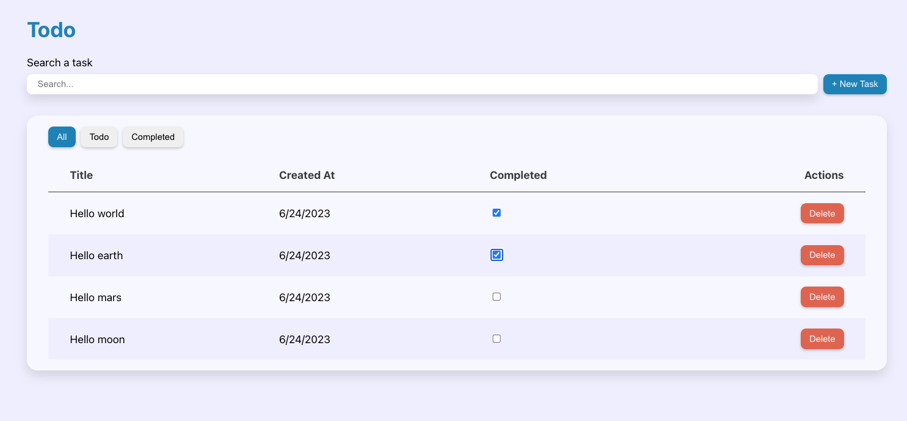
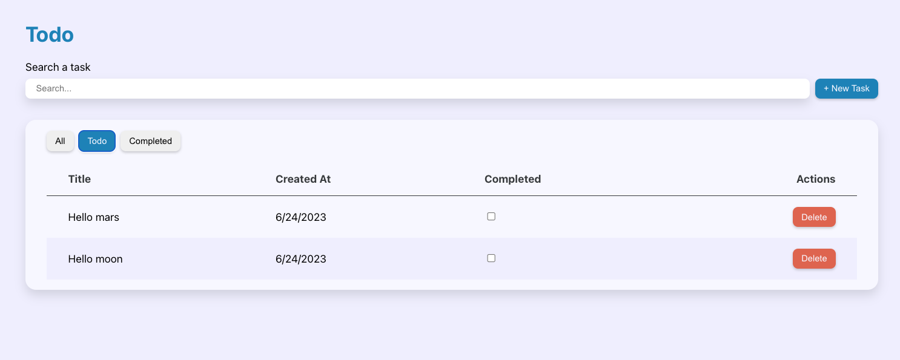
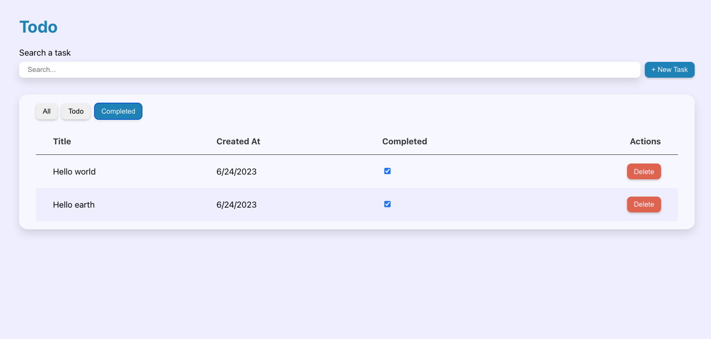

# ⚛️ React Master - Todo list: Révisions & function as children (Exercice)

## Sommaire

<!-- no toc -->
*   [Notions](#notions-de-lexercice)
*   [Consignes](#consignes)
*   [Correction](#correction)

## Notions de l'exercice

*   Props
*   State
*   Function as children
*   Composants d'ordre supérieur

## Consignes

Pour cet exercice, tu vas devoir cloner le dépôt.

Tu peux taper la commande suivante dans ton terminal:

```bash
git clone git@github.com:Atomic-React/react-master-todo-list.git
```

Ensuite, rends toi dans le dossier avec la commande suivante:

```bash
cd react-master-todo-list
```

Accède à la branche de l'exercice en exécutant la commande:

```bash
git switch ex10/exercise
```

Puis installes les dépendances avec la commande:

```bash
npm install
```

Tu peux maintenant te rendre sur l'URL <http://localhost:5173>.

Le but de cet exercice est de réaliser les fonctionnalités suivantes:

*   Ajouter une `checkbox` aux tâches pour permettre de les marquer comme _complétées_
*   Intégrer un système d'onglets permettant de trier les tâches selons trois vues: _"Toutes"_, _"À faire"_, _"Terminées"_.

Voici le rendu final attendu:



Rendu des tâches à faire:



Rendu des tâches terminées:



Pour réliser la partie de l'exercice qui consiste à ajouter une `checkbox`, voici les indications:

*   Ajoute une propriété `isDone` aux tâches
*   Crée un composant `Checkbox` dans le dossier `components/forms/`
*   L'état `isDone` de la tâche concernée doit se mettre à jour lorsque l'utilisateur coche ou décoche la case

Pour réaliser la seconde partie, tu vas devoir créer un composant `Tabs` capable de recevoir en tant que `props` la propriété `defaultActiveTabId` permettant de sélectionner un onglet à afficher par défaut et `tabs`, le tableau des onglets à afficher.

Voici le tableau `tabs`:

```jsx
const tabs = [
	{
		id: 0,
		title: 'All',
	},
	{
		id: 1,
		title: 'Todo',
	},
	{
		id: 2,
		title: 'Completed',
	},
];
```

Tu remarques que cette fois-ci, il n'y a pas de propriété `content`.

L'idée ici est de pouvoir utiliser un pattern qui s'appelle _"Function as children"_.

On va s'attendre à ce que le composant `Tabs` soit capable de prendre une fonction en tant qu'enfant. Cette fonction renverrai l'`id` de l'onglet en cours d'affichage. En fonction de cet `id`, on afficherait le contenu adéquat.

Voici un exemple de ce qui est attendu:

```jsx
<Tabs tabs={ tabs } defaultActiveTabId={ 0 }>
	{
		({ activeTabId }) => (
			<>
				{ activeTabId === 0 && /* Content A */ }
				{ activeTabId === 1 && /* Content B */ }
				{ activeTabId === 2 && /* Content C */ }
			</>
		)
	}
</Tabs>
```

Voici un lien vers l'ancienne documentation de **React** qui parle des _functions as children_: <https://legacy.reactjs.org/docs/jsx-in-depth.html#functions-as-children>

Les _functions as children_ ne sont pas incrits dans la nouvelle documentation car ce n'est pas une fonctionnalité de **React** mais un pattern.

Enfin, pour le filtrage des tâches, tu devra utiliser le pattern des composant d'ordre supérieur en t'inspirant de ce qui a été fait dans l'exercice précédent.

Le système de recherche doit rester fonctionnel pour tous les onglets !

Bon courage ! 💪

## Correction

Tu peux consulter la correction écrite ici: <https://github.com/Atomic-React/react-master-todo-list/tree/ex10/correction#correction>

Ou suivre la correction en vidéo ici: _Bientôt disponible_
