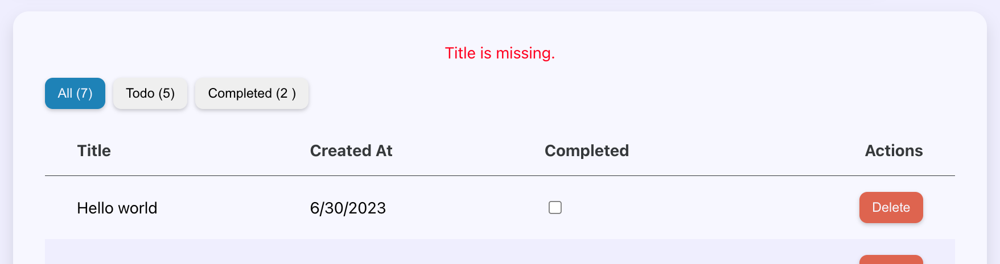
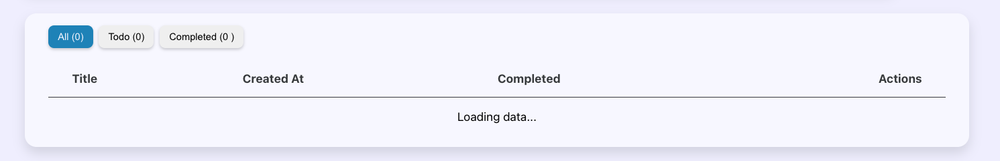

# ⚛️ React Master - Todo list: Gérer l'état d'erreur et l'état de chargement (Exercice)

## Sommaire

<!-- no toc -->
*   [Notions](#notions-de-lexercice)
*   [Consignes](#consignes)
*   [Correction](#correction)

## Notions de l'exercice

*   Context
*   Reducer

## Consignes

Sauvegarde d'abord le travail de l'exercice précédent:

```bash
git add .
```

```bash
git commit -m "exercice terminé"
```

Ensuite, accède à la branche de l'exercice en exécutant la commande:

```bash
git switch ex14/exercise
```

Puis installes les dépendances avec la commande:

```bash
npm install
```

Et lance l'application:

```bash
npm run dev
```

Tu peux maintenant te rendre sur l'URL <http://localhost:5173>.

Pour cet exercice, tu vas devoir gérer l'état de chargement, et l'état d'erreur accompagné des messages d'erreurs éventuels.

J'ai apporté quelques modifications à l'application pour que tu puisses partir sur de meilleures bases.

Tout d'abord, j'ai ajouté la récupération des messages d'erreurs dans les fonction de `tasks.service.js`.

C'est ce code ci que tu vois dans chaque fonction:

```JSX
if (!response.ok) {
	throw new Error(json.error);
}
```

Cela te servira pour récupérer les messages d'erreurs.

J'ai aussi commenté une partie de la fonction `validateForm` qui se trouve dans le composant `CreateTaskFormModal`:

```JSX
const validateForm = () => {
	let errors;
	// const { title } = formValue;
	// if (title.length < 3) {
	// 	errors = {
	// 		...errors,
	// 		title: 'The task title must contain at least 3 characters.',
	// 	};
	// }
	setValidationsErrors(errors);
	return errors;
};
```

De cette façon, tu pourra tester plus facilement le cas d'erreur avec un exemple accessible directement.

Comme il n'y a plus de validation du champ "titre", tu vas pouvoir envoyer un titre vide à l'API. Sauf que l'API n'aime pas ça, elle te renverra un message d'erreur que tu devra traiter et afficher comme tu peux le voir ci-dessous:



Ce message d'erreur devra forcément passer par l'état du contexte puisque c'est dans le composant du contexte que les requêtes API sont effectuées. Cela veut dire que tu as certainement besoin de toucher au `reducer` pour créer des actions supplémentaires.

Il faudra aussi que tu gère l'état de chargement.

Dans le service `tasks.service.js`, j'ai ajouté un temps de latence factice sur la requête des tâches:

```JSX
const wait = (delay = 3000) => new Promise((resolve) => {
	setTimeout(() => resolve(), delay);
});

export const getTasks = async () => {
	try {
		await wait(); // ICI => On attend 3 secondes que les tâches chargent
		const response = await fetch(`${apiURL}/tasks`);
		const json = await response.json();
		if (!response.ok) {
			throw new Error(json.error);
		}
		return json;
	} catch (error) {
		console.error(error);
		throw error;
	}
};
```

Pendant le chargement, tu devra afficher le message _"Loading data..."_ à la place du tableau des tâches:



Rappelle toi qu'il y a un moment maintenant, nous avions ajouté une propriétés `isLoading` sur le composant `TasksTable`. Tu peux certainement t'en servir ! Je te laisse regarder ça.

Comme pour l'état d'erreur, tu devra utiliser le `reducer` du contexte et certainement créer une action pour l'état de chargement.

Bon courage ! 💪

## Correction

Tu peux consulter la correction vidéo sur [Atomic React](https://atomic-react.com) ou te rendre sur la branche `ex14/correction`.

Pense à sauvegarder ton travail avec les commandes ci-dessous avant de changer de branche !

```bash
git add .
```

```bash
git commit -m "Sauvegarde"
```
