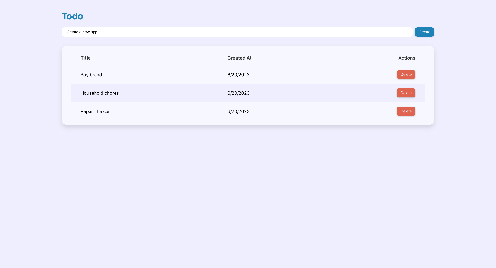
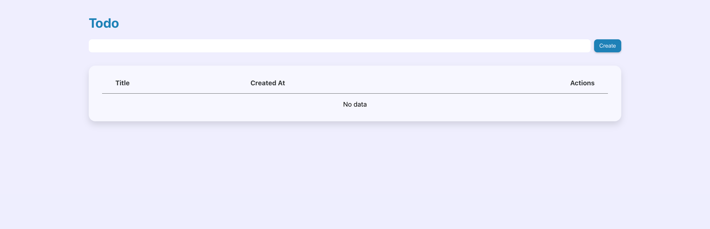

# ⚛️ React Master - Todo list: Révisions et composants non-contrôlés

Dans cet énoncé tu trouvra:

1 ℹ️ information<br>
2 💡 indices

## Sommaire

<!-- no toc -->
* [Notions](#notions-de-lexercice)
* [Consignes](#consignes)
* [Correction](#correction)

## Notions de l'exercice

* Événements
* Props
* Gestion d'état
* Cycle de vie
* Typage des props
* Composition
* Composants contrôlés

## Consignes

Pour cet exercice, tu vas devoir cloner le dépôt.

Tu peux taper la commande suivante dans ton terminal:

```bash
git clone git@github.com:Atomic-React/react-master-todo-list.git
```

Ensuite, rends toi dans le dossier avec la commande suivante:

```bash
cd react-master-todo-list
```

Accède à la branche de l'exercice en exécutant la commande:

```bash
git switch ex01/exercise
```

Puis installes les dépendances avec la commande:

```bash
npm install
```

Tu peux maintenant te rendre sur l'URL <http://localhost:5173>. Tu vera qu'il y a déjà quelques éléments.

Ta mission désormais va être de compléter l'application pour obtenir ce rendu final:



Sur la page que tu as actuellement dans ton navigateur, il manque le champ texte permettant d'inscrire le titre d'une tâche, le bouton _"Create"_ pour valider la création de la tâche et le tableau des tâches.

Tu devra donc ajouter toi-même ce champ texte et faire en sorte qu'après chaque ajout de tâche, le champ se réinitialise automatiquement.

<details>
 <summary>💡 <b>Indice</b></summary>

 > Pour réinitialiser le champ, il se peut que tu éprouves de la difficulté à le faire sans que cela n'occasionne un bug lors de l'ajout d'une tâche au tableau.
 >
 > Si tu réinitialises le champ dans la fonction d'ajout d'une tâche, même après l'exécution de la mise à jour du `state`, il se peut que la tâche que tu viens d'ajouter se voit perdre son `title`.
 >
 > C'est dû au fait que le _setter_ du `state` est asynchrone.
 >
 > Tu peux contourner le problème en utilisant le cycle de vie avec `useEffect` en le mettant en écoute sur les mises à jour apportées au tableau des tâches dans le `state`

</details>

Jète un oeil du côté des **composants non-contrôlés** (_uncontrolled components_ en anglais) pour le réaliser: <https://react.dev/learn/sharing-state-between-components#controlled-and-uncontrolled-components>

<details>
 <summary>💡 <b>Indice</b></summary>

 > Le hook `useRef` permet d'interagir avec des éléments HTML. Il est utilisé pour interagir avec les `input` et faire ce que l'on appelle des "champs non-controllés"
 >
 > Voici le lien vers la documentation de **React** qui parle de `useRef`: <https://react.dev/reference/react/useRef>

</details>

**Attention !** **Tu ne dois pas faire de composant contrôlé** (n'utilise pas le `state` pour gérer la valeur de ton `input`). Nous verrons cela prochainement.

Tu peux également constater qu'il y a un tableau à réaliser. Tu dois y afficher la liste des tâches et un bouton _"Delete"_ permettant de supprimer chaque tâche individuellement.

Chaque tâche devra contenir les informations suivantes:

* Un `id` unique de type `number`
* Un `title` de type `string`
* Une date de création `created_at` de type `Date`

S'il n'y a pas de tâche dans le tableau, le tableau devra afficher un texte indiquant _"No data"_ comme ceci:



Évidemment, tu devra faire attention aux `prop-types`

> ℹ️ **Information**
>
> Le CSS t'es en partie donné. Regarde le fichier `index.css` dans le dossier `src/`, tu y trouvera tout ce dont tu as besoin.

Tu remarques qu'il y a une nouvelle architecture dans le dossier `components/`. Les fichiers de composants ne sont plus simplement placés dans ce dossier, ils sont rangés dans des sous-dossiers:

* Le dossier `ui` contient les composants d'interface utilisateur qui sont génériques comme les boutons, les modales, les conteneurs, etc...
* Le dossier `features` contient les composants qui sont propres aux fonctionnalités de l'application. Dans notre cas, il rassemble les composants qui ont un rapport avec la gestion des tâches de la todo-list.

Les composants sont eux-mêmes placés dans des dossiers selon leur nom. Par exemple, le composant `Button` est dans le fichier `index.jsx` placé dans le dossier `Button/`.

Cette approche permet de placer dans le dossier d'un composant tous les autres fichiers qui auraient un lien direct et exclusif avec lui (comme les images, le CSS ou d'autres composants enfant). C'est le cas du fichier `Button.css` qui ne concerne que le composant `Button`.

Bon courage ! 💪

## Correction

Tu peux consulter la correction écrite ici: <https://github.com/Atomic-React/react-master-todo-list/tree/ex01/correction#correction>

Ou suivre la correction en vidéo ici: _Bientôt disponible_
