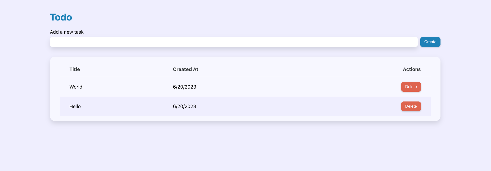
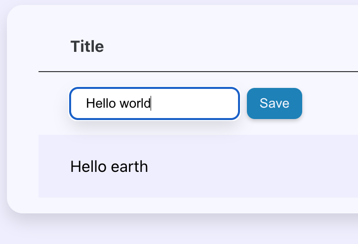

# ⚛️ React Master - Todo list: Modification des tâches (Exercice)

## Sommaire

<!-- no toc -->
*   [Notions](#notions-de-lexercice)
*   [Consignes](#consignes)
*   [Correction](#correction)

## Notions de l'exercice

*   Événements
*   Props
*   Gestion d'état
*   Typage des props
*   Composants contrôlés
*   Passage de référence

## Consignes

Sauvegarde d'abord le travail de l'exercice précédent:

```bash
git add .
```

```bash
git commit -m "exercice terminé"
```

Ensuite, accède à la branche de l'exercice en exécutant la commande:

```bash
git switch ex02/exercise
```

Puis installes les dépendances avec la commande:

```bash
npm install
```

Et lance l'application:

```bash
npm run dev
```

Tu peux maintenant te rendre sur l'URL <http://localhost:5173>.

Voici une capture d'écran du rendu final que tu dois obtenir:



Tu remarques le `label` au dessus du champ de création d'une nouvelle tâche.

L'idée ici c'est permettre à l'utilisateur de cliquer sur le titre d'une tâche pour faire apparaître un champ pré-rempli avec le titre et lui permettre de modifier ce titre. Un bouton d'enregistrement doit être placé à côté du champ pour valider la modification.

Une fois la modification faite, le champ doit disparaitre et la ligne de la tâche doit s'afficher comme avant que l'utilisateur ne clique dessus.

Voici à quoi cela doit ressembler:



Pour réaliser cela, tu devra créer un composant dédié au champ que tu pourra appeler à plusieurs endroits.

Il n'est pas question de redévelopper plusieurs fois la même `input`. Tu l'as déjà, elle se trouve dans le composant `App`. Il te suffit de la récupérer et de la placer dans ce fameux composant dédié. Tu devra alors remplacé le champ dans `App.jsx` par le composant en question.

Tu placera ce composant dans le dossier `forms/` qui a été ajouté dans le dossier `components/`.

Ce composant devra être capable de prendre en charge un `label` optionnel. Tu devras donc rajouter la structure HTML nécessaire pour que ce label puisse être ajouté et relié à l'`input`.

<details>
 <summary>💡 <b>Indice</b></summary>

 > Tu vas avoir plusieurs champs avec des labels sur la même page. Pour relier chaque champ à chaque label, l'une des méthodes possibles consiste à utiliser l'`id` du champ pour le mettre en tant que valeur de l'attribut `for` du label.
 >
 > Pour éviter les conflits d'`id`, tu devras en générer un unique à chaque fois que tu fais appel à ton composant. Pour cela, **React** met à ta disposition le hook `useId`.
 >
 > Voici le lien de la documentation **React** qui en parle: <https://react.dev/reference/react/useId>

</details>

Nous travaillons toujours avec les références et les composants non-contrôlés. À toi de trouver comment faire pour communiquer une référence d'un composant parent à un composant enfant et vice-vers-ça.

<details>
 <summary>💡 <b>Indice</b></summary>

 > Pour transmettre des références entre composants, renseignes-toi la fonction `forwardRef`
 >
 > Voici le lien de la documentation **React** qui en parle: <https://react.dev/reference/react/forwardRef>

</details>

Bon courage ! 💪

## Correction

Tu peux consulter la correction vidéo sur [Atomic React](https://atomic-react.com) ou te rendre sur la branche `ex02/correction`.

Pense à sauvegarder ton travail avec les commandes ci-dessous avant de changer de branche !

```bash
git add .
```

```bash
git commit -m "Sauvegarde"
```
